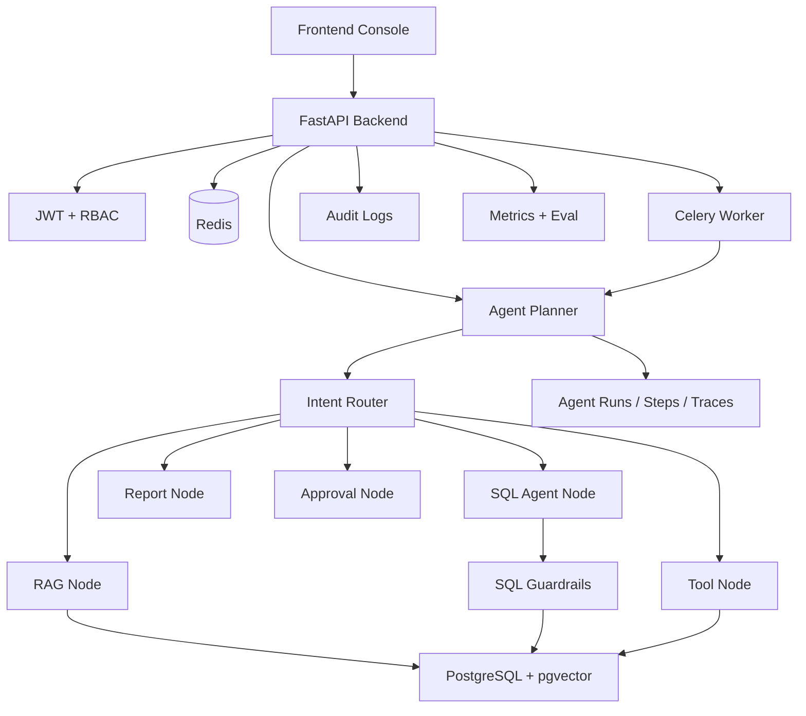
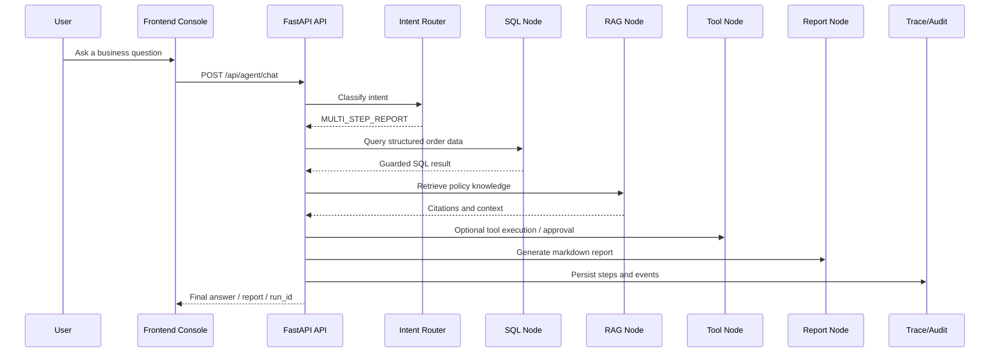

# Enterprise Multi-Tool Agent Platform

<p align="center">
  
</p>

<p align="center">
  <strong>Author:</strong> <a href="https://github.com/Beverly621">GitHub @Beverly621</a>
</p>


<p align="center">
  
  
  
  
  
</p>

> Full-stack AI Agent engineering project for multi-tool orchestration, RAG, SQL Guardrails, async workflows, traceability, and evaluation.
> Chinese project name: 企业级多工具知识库 Agent 平台.  
> Chinese documentation: [`README_ZH.md`](README_ZH.md).

Enterprise Multi-Tool Agent Platform is **an enterprise-grade multi-tool AI Agent platform that combines RAG, SQL Agent, Tool Calling, multi-step planning, asynchronous report generation, RBAC, SQL Guardrails, human-in-the-loop approvals, tracing, audit logging, metrics, evaluation workflows, and a full-stack admin console.**

This repository is designed as a full-stack AI Agent engineering project rather than a consumer-facing product. It demonstrates how an enterprise-style Agent platform can connect unstructured knowledge-base documents, structured business data, tool execution, approval workflows, asynchronous tasks, observability, evaluation, and CI/CD into one coherent full-stack system.

The project is intentionally built beyond a simple RAG chatbot. A normal RAG demo answers questions from documents; this platform routes user intent across RAG, SQL analytics, tool calls, multi-step report generation, approvals, trace replay, audit logs, and frontend operations pages.

## Metrics Snapshot

| Metric | Value | Source |
|---|---:|---|
| Total Eval Cases | 171 | `backend/app/evals/*.jsonl` |
| Overall Eval Pass Rate | 100.00% (144/144) | `backend/app/eval_results/all_eval.json` |
| RAG Eval Pass Rate | 100.00% (30/30) | `backend/app/eval_results/rag_eval.json` |
| SQL Guardrails Unsafe SQL Block Rate | 100.00% (43/43) | `backend/app/eval_results/sql_guardrails_eval.json` |
| Tool Calling Eval Pass Rate | 100.00% (30/30) | `backend/app/eval_results/tool_eval.json` |
| Regression Pass Rate | 100.00% (27/27) | `backend/app/eval_results/regression.json` |
| Async Submit p95 Latency | 0.007 ms (local benchmark, `run_id` return only) | `backend/app/eval_results/async_benchmark.json` |
| Trace Replay Success Rate | 100.00% (10/10) | `backend/app/eval_results/trace_benchmark.json` |

> Metrics are generated from synthetic demo data and Mock providers.
> Async latency measures the time to return `run_id`, not full Agent workflow completion time.

## Why This Project

Real enterprise Agent systems usually need to answer questions that cross several boundaries:

- Unstructured internal documents, such as policies, return rules, and after-sales procedures.
- Structured operational data, such as orders, reviews, customer regions, and issue types.
- Business tools that may read or write internal state.
- Human approval for sensitive or high-impact actions.
- Role-based access control, audit logs, traceability, and repeatable evaluation.

This project uses an order-abnormality analysis scenario to show that complete AI Agent engineering is not only about prompts. It also requires safe SQL generation, tool permissions, async execution, reproducible demo data, local mock providers, evaluation datasets, and operational visibility.

Engineering questions this project addresses:

- How can an Agent combine unstructured documents and structured business data?
- How can generated SQL be constrained before execution?
- How can tool permissions and approvals reduce automation risk?
- How can each Agent run be traced and audited?
- How can a public demo run without real API keys?
- How can new Agent capabilities be checked with regression and eval workflows?

## Key Features

| Capability | Description |
|---|---|
| RAG Knowledge Base | Supports knowledge-base creation, document upload, parsing, chunking, embedding abstraction, pgvector retrieval, RAG answers, and citations. |
| SQL Agent | Reads an allowed demo schema, generates SQL for business questions, executes guarded read-only queries, and explains results. |
| SQL Guardrails | Blocks mutating SQL, DDL, multiple statements, `SELECT *`, sensitive tables, sensitive fields, and oversized result sets before execution. |
| Tool Calling | Provides a database-backed tool registry, JSON Schema validation, role checks, execution records, timeouts, retries, and traceable results. |
| Human-in-the-loop Approval | Sensitive tools such as `send_email_draft` create approval records instead of executing external side effects automatically. |
| Agent Planner | Routes `GENERAL_CHAT`, `RAG_QA`, `SQL_QUERY`, `TOOL_CALL`, `MULTI_STEP_REPORT`, and `NEED_APPROVAL` intents through explicit nodes. |
| Async Agent Tasks | Uses Celery and Redis for long-running Agent/report workflows with progress APIs, cancellation, failed task records, and idempotency support. |
| Report Generation | Produces Markdown business reports and stores report history for review from the console. |
| RBAC | Seeds Admin, Developer, User, and Guest roles with different API and tool capabilities. |
| Trace & Audit Logs | Persists Agent runs, steps, traces, SQL logs, tool calls, approvals, and audit events for debugging and review. |
| Metrics & Evaluation | Includes provider call metrics, runtime metrics APIs, RAG eval, SQL Guardrails eval, tool eval, and Agent regression runners. |
| Frontend Console | Next.js console for dashboard, knowledge base, Agent chat, SQL Agent, tools, approvals, runs, tasks, reports, audit, and admin users. |
| Mock Provider | Mock LLM and embedding providers make local demos and CI-style validation possible without real provider keys. |
| Docker & CI/CD | Includes Docker Compose, production Compose template, Dockerfiles, GitHub Actions, environment checks, smoke tests, and public safety scanning. |

## System Architecture



More architecture detail: [`docs/ARCHITECTURE_OVERVIEW.md`](docs/ARCHITECTURE_OVERVIEW.md) and [`docs/ARCHITECTURE_EXPLAIN.md`](docs/ARCHITECTURE_EXPLAIN.md).

## Agent Workflow



Supported Agent intents:

- `GENERAL_CHAT`
- `RAG_QA`
- `SQL_QUERY`
- `TOOL_CALL`
- `MULTI_STEP_REPORT`
- `NEED_APPROVAL`

## Tech Stack

| Layer | Technology |
|---|---|
| Frontend | Next.js 16, React 19, TypeScript, Tailwind CSS, lucide-react |
| Backend | FastAPI, Python, SQLAlchemy 2.x, Pydantic 2, Uvicorn |
| Database | PostgreSQL 16 + pgvector |
| Vector Search | pgvector |
| Cache / Queue | Redis |
| Async Tasks | Celery |
| Auth | JWT + RBAC |
| Migration | Alembic |
| Agent Runtime | Lightweight Agent runtime with explicit planner/node boundaries |
| LLM Providers | Mock provider by default; OpenAI adapter implemented; Anthropic and DeepSeek env variables are reserved placeholders |
| Embedding Providers | Mock embedding provider by default; OpenAI embedding adapter implemented |
| DevOps | Docker Compose, production Compose template, Nginx config, GitHub Actions |
| Testing / Evaluation | pytest, frontend lint/build, Docker smoke test, public safety scripts, eval and regression runners |

## Demo Scenario: Order Abnormality Analysis with Knowledge-Grounded Agent Workflow

The demo simulates an enterprise support and operations scenario:

- Structured order data is stored in PostgreSQL.
- Policy and after-sales documents are indexed in the knowledge base.
- The Agent combines SQL analysis and RAG retrieval.
- The final output is a Markdown report with traceable steps.
- Sensitive or high-impact tool actions require human approval.

The demo dataset is synthetic and self-generated for portfolio demonstration. It does not contain real enterprise orders, real customer records, real complaints, private internal documents, or production data.

Verified demo CSV scale:

| Demo file | Rows |
|---|---:|
| `data/demo_orders/demo_customers.csv` | 60 |
| `data/demo_orders/demo_products.csv` | 40 |
| `data/demo_orders/demo_orders.csv` | 320 |
| `data/demo_orders/demo_order_items.csv` | 400 |
| `data/demo_orders/demo_reviews.csv` | 320 |
| `data/demo_orders/demo_after_sales.csv` | 153 |

Example demo questions:

```text
Which region has the highest number of abnormal orders?
What should employees do when they encounter a conflict of interest?
Generate an analysis report combining recent abnormal order data and after-sales knowledge base.
Create an email draft for the generated report and wait for approval.
```

## Project Development Roadmap

| Stage | Focus | Outcome |
|---|---|---|
| Stage 1 | Backend Foundation & Database Design | FastAPI, PostgreSQL + pgvector, Redis, Celery, JWT, RBAC, Alembic, and Docker Compose foundation. |
| Stage 2 | RAG Knowledge Base | Document parsing, chunking, embedding abstraction, vector storage, retrieval APIs, and citation-aware answers. |
| Stage 3 | SQL Agent | Demo business schema, schema reader, SQL generation, guarded execution, result explanation, and SQL logs. |
| Stage 4 | Tool Calling | Tool registry, JSON Schema validation, role checks, execution records, built-in tools, and approvals. |
| Milestone Test 1 | Foundation / RAG / SQL / Tools | First milestone validation for stages 1-4 with bug fixes and regression coverage. |
| Stage 5 | Agent Planner | Intent routing and multi-step orchestration across RAG, SQL, Tool, Report, Approval, and Final nodes. |
| Stage 6 | Async Tasks & Reports | Celery-backed async Agent runs, task progress, cancellation, idempotency, failed tasks, and report history. |
| Stage 7 | Frontend Console | Full-stack console for dashboard, KB, Agent chat, SQL Agent, tools, approvals, runs, tasks, reports, audit, and users. |
| Stage 8 | Demo Data & GitHub Documentation | Public-safe synthetic demo data, demo docs, demo guide, cases, and repository presentation material. |
| Milestone Test 2 | Planner / Async / Frontend / Demo | Second validation across multi-step workflows, async tasks, console pages, and demo assets. |
| Stage 9 | Observability & Evaluation | Provider calls, runtime metrics, eval datasets, RAG eval, SQL Guardrails eval, tool eval, and Agent regression. |
| Stage 10 | Deployment & CI/CD | Production Compose, Dockerfiles, environment checks, GitHub Actions, smoke tests, and public safety checks. |
| Stage 11 | Resume / Demo / Interview Documentation | Resume descriptions, interview Q&A, architecture explanation, demo script, technical highlights, and project story. |
| Stage 12 | Final Release Preparation | Release notes, final checklist, final roadmap, final repo check, final smoke test, and validation preparation. |
| Final Validation | End-to-end project review | Final validation guidance and readiness review for GitHub portfolio presentation. |

## Engineering Highlights

### 1. Multi-tool Agent runtime instead of a single RAG chatbot

The Agent entrypoint routes requests across chat, RAG, SQL analytics, tool execution, approval-required actions, and multi-step reports. This keeps the user experience unified while preserving explicit internal boundaries that can be tested and traced.

Key modules: `backend/app/agent/`, `backend/app/services/planner_service.py`, `backend/app/api/agent_chat.py`.

### 2. SQL Guardrails for safe structured data access

Generated SQL is validated before execution. Guardrails only allow safe read-only `SELECT` statements, block sensitive tables and fields, reject `SELECT *`, disallow multiple statements, and enforce result limits.

Key modules: `backend/app/services/sql_guardrails.py`, `backend/app/services/sql_executor.py`, `backend/app/services/schema_reader.py`.

### 3. Human-in-the-loop approval for sensitive tool actions

Tools that may represent high-impact actions can create approval records instead of executing automatically. The `send_email_draft` tool is intentionally approval-gated and does not send real email directly.

Key modules: `backend/app/services/approval_service.py`, `backend/app/api/approvals.py`, `frontend/app/approvals/page.tsx`.

### 4. Async report generation with progress tracking

Long-running Agent workflows can run through Celery and Redis. The system stores task progress, failed task records, idempotency keys, and report history so the frontend can display operational state instead of waiting on a blocking HTTP request.

Key modules: `backend/app/tasks/`, `backend/app/services/task_progress_service.py`, `backend/app/services/report_history_service.py`.

### 5. Full traceability across Agent runs

Agent behavior is inspectable through persisted runs, steps, traces, SQL logs, tool calls, approvals, reports, and audit logs. This makes multi-step workflows easier to debug and easier to explain during technical review.

Key modules: `backend/app/services/tracing_service.py`, `backend/app/api/runs.py`, `frontend/app/runs/`.

### 6. Mock providers for reproducible public demos

Mock LLM and embedding providers allow the demo and tests to run without real model credentials. OpenAI adapters are implemented for real-provider extension, but public validation can use mock mode by default.

Key modules: `backend/app/services/mock_provider.py`, `backend/app/services/openai_provider.py`, `backend/app/services/provider_factory.py`.

### 7. Evaluation datasets and regression runners

The repository includes JSONL eval datasets and scripts for RAG, SQL Guardrails, Tool Calling, Agent eval, and core regression checks. This gives the project a quality-control path beyond manual demo clicking.

Key modules: `backend/app/evals/`, `backend/app/scripts/run_eval.py`, `backend/app/scripts/run_regression.py`.

### 8. Full-stack console for debugging and demonstration

The Next.js console surfaces backend state through pages for knowledge bases, Agent runs, SQL results, tools, approvals, tasks, reports, audit, and admin users. It is designed for engineering visibility and interview demonstration rather than consumer product onboarding.

Key modules: `frontend/app/`, `frontend/components/`, `frontend/lib/api.ts`.

### 9. GitHub public safety and CI/CD checks

The project includes `.gitignore`, `.env.example`, safety scripts, Docker smoke tests, pre-deploy checks, and GitHub Actions for backend, frontend, Docker build, and public-safety validation.

Key modules: `scripts/`, `.github/workflows/`, `deploy/`.

## Security and Safety Design

| Area | Mechanism |
|---|---|
| RBAC | Admin, Developer, User, and Guest roles are seeded with different permissions. |
| SQL Guardrails | Generated SQL is checked before execution and limited to allowed demo business tables. |
| Tool Permission | Built-in tools declare permission levels and approval requirements. |
| Approval Flow | Sensitive tools create approval records and wait for human review. |
| Audit Logs | Login, Agent chat, SQL queries, tool calls, approvals, reports, and key security events are audit-ready. |
| Secret Handling | `.env` and local secret files are ignored; examples use placeholders only. |
| Mock Provider by Default | Public demo mode does not require real model provider keys. |
| Synthetic Demo Data | Demo documents and CSV files are self-generated or simulated for portfolio use. |
| Public Safety Checks | Scripts check for tracked env files, generated artifacts, and high-confidence secret patterns. |

This repository should not be described as production-proven. It is a production-oriented engineering implementation that would still need tenant isolation, SSO, monitoring, backups, rate limiting, runtime alerting, incident procedures, and real deployment hardening before production use.

## Observability and Evaluation

| Area | Status | Notes |
|---|---|---|
| Agent Run Trace | Implemented | Agent runs, steps, and trace events are persisted and exposed through run APIs. |
| Tool Call Logs | Implemented | Tool execution writes tool call records and trace/audit events. |
| SQL Query Logs | Implemented | SQL Agent queries record generated SQL, blocked reasons, previews, row counts, and timings. |
| Audit Logs | Implemented | Security and workflow events are designed for auditability with sanitized metadata. |
| Provider Call Metrics | Implemented | Mock and OpenAI provider calls can record model, request type, status, latency, tokens/cost estimates, and sanitized errors. |
| RAG Eval | Implemented | Uses `backend/app/evals/rag_eval_cases.jsonl` and `python -m app.scripts.run_eval --type rag`. |
| SQL Guardrails Eval | Implemented | Covers safe selects, mutating SQL, DDL, sensitive tables/fields, missing limits, and bypass attempts. |
| Tool Eval | Implemented | Checks tool existence, permissions, approval requirements, and SQL Guardrails reuse. |
| Agent Regression | Implemented | Uses regression cases for core demo intent routing and safety behavior. |
| Langfuse / OpenTelemetry | Planned | Trace and provider-call structures are designed for future exporter integration. |

Metric definitions:

- Eval Pass Rate = passed cases / total cases from `python -m app.scripts.run_eval --type all`.
- RAG Eval Pass Rate = passed RAG cases / total RAG cases from `python -m app.scripts.run_eval --type rag`.
- Unsafe SQL Block Rate = blocked unsafe SQL cases / total unsafe SQL cases from `python -m app.scripts.run_eval --type sql-guardrails`.
- Tool Calling Eval Pass Rate = passed tool cases / total tool cases from `python -m app.scripts.run_eval --type tool`.
- Regression Pass Rate = passed regression cases / total regression cases from `python -m app.scripts.run_regression`.
- Async Submit Latency = time to return `run_id` from `python -m app.scripts.benchmark_async`, not full task completion time.
- Trace Replay Success Rate = failed Agent runs with retrievable run, steps, tool call, SQL log, audit log, and error / total checked failed runs from `python -m app.scripts.benchmark_trace`.
- Public validation uses Mock providers and synthetic demo data, so it does not require real model API keys or private enterprise data.

Metrics APIs include:

- `GET /api/metrics/summary`
- `GET /api/metrics/agent-runs`
- `GET /api/metrics/rag`
- `GET /api/metrics/sql-guardrails`
- `GET /api/metrics/tools`
- `GET /api/metrics/tasks`
- `GET /api/metrics/providers`
- `GET /api/evals/runs`
- `GET /api/evals/runs/{eval_run_id}`

## Frontend Console

The console is designed for debugging and demonstrating enterprise Agent workflows, not as a consumer-facing product UI.

Verified pages:

| Page | Path | Purpose |
|---|---|---|
| Login | `/login` | Demo account login and token setup. |
| Dashboard | `/dashboard` | High-level operational and metrics summary. |
| Knowledge Base | `/kb`, `/kb/[id]` | Knowledge-base list, detail, document upload, and document status. |
| Agent Chat | `/agent` | Unified Agent interaction for chat, RAG, SQL, tools, async runs, and reports. |
| SQL Agent | `/sql-agent` | Natural-language SQL analytics and guarded execution results. |
| Tools | `/tools`, `/tools/[toolName]` | Tool registry, schema inspection, and invocation panel. |
| Approvals | `/approvals` | Human approval and rejection flow. |
| Runs / Trace | `/runs`, `/runs/[runId]` | Agent run detail, steps, traces, tool calls, task progress, and linked reports. |
| Tasks | `/tasks` | Async task progress and status. |
| Reports | `/reports`, `/reports/[reportId]` | Markdown report history and report details. |
| Audit | `/audit` | Audit log review. |
| Admin Users | `/admin/users` | Admin-facing user list. |

An independent Metrics/Eval page was not found in the verified `frontend/app` tree. Metrics are represented through backend APIs and dashboard-oriented summaries.

## Repository Structure

```text
.
├── backend/                  # FastAPI backend, Agent runtime, services, models, tasks, tests
├── frontend/                 # Next.js console and UI components
├── data/                     # Synthetic demo documents and demo order CSV files
├── docs/                     # Architecture, demo, deployment, eval, roadmap, and presentation docs
├── scripts/                  # Seed, smoke test, safety, environment, and deployment check scripts
├── deploy/                   # Production Compose template, Nginx config, and platform notes
├── .github/workflows/        # Backend CI, frontend CI, Docker build, and public safety workflows
├── docker-compose.yml        # Local development/demo Compose stack
├── pyproject.toml            # Python project/tooling configuration
├── RELEASE_NOTES.md          # Release notes
├── LICENSE                   # MIT License
└── README.md                 # Public project overview
```

## Local Demo Notes

This repository is primarily a full-stack AI Agent engineering project. The Docker-first local demo has been verified with Mock providers and synthetic demo data.

Docker-first local demo:

```bash
cp .env.example .env
cp frontend/.env.example frontend/.env.local
docker compose up -d --build
bash scripts/seed_demo_data.sh
```

Open:

- Backend Swagger: `http://localhost:8100/docs`
- Health check: `http://localhost:8100/health`
- Frontend console: `http://localhost:3100`

Frontend-only development server:

```bash
cd frontend
npm install
npm run dev
```

Common validation commands:

```bash
cd backend
python -m pytest app/tests

cd ../frontend
npm run lint
npm run build

cd ..
bash scripts/check_public_safety.sh
```

Eval examples:

```bash
cd backend
python -m app.scripts.run_eval --type rag
python -m app.scripts.run_eval --type sql-guardrails
python -m app.scripts.run_eval --type tool
python -m app.scripts.run_regression
```

## Demo Accounts

Demo accounts are defined in `backend/app/seed/seed_users.py`:

| Role | Email | Password | Purpose |
|---|---|---|---|
| Admin | `admin@example.com` | `admin123` | Full demo administration and audit access. |
| Developer | `developer@example.com` | `dev123` | SQL Agent, traces, tool registration, and developer workflows. |
| User | `user@example.com` | `user123` | Knowledge-base chat, reports, tools, and standard Agent workflows. |
| Guest | `guest@example.com` | `guest123` | Public knowledge-base read access. |

These are demo-only credentials and should not be used as production credentials.

## Documentation Map

| Document | Purpose |
|---|---|
| [`docs/DEMO_GUIDE.md`](docs/DEMO_GUIDE.md) | Step-by-step local demo guide. |
| [`docs/DEMO_CASES.md`](docs/DEMO_CASES.md) | Eight demo cases covering chat, RAG, SQL, tools, reports, async tasks, approvals, and Guardrails. |
| [`docs/PUBLIC_DATA_SOURCES.md`](docs/PUBLIC_DATA_SOURCES.md) | Public-safe data statement and synthetic demo data explanation. |
| [`docs/ARCHITECTURE_OVERVIEW.md`](docs/ARCHITECTURE_OVERVIEW.md) | System architecture overview. |
| [`docs/ARCHITECTURE_EXPLAIN.md`](docs/ARCHITECTURE_EXPLAIN.md) | Architecture explanation for presentation and interview. |
| [`docs/TECHNICAL_HIGHLIGHTS.md`](docs/TECHNICAL_HIGHLIGHTS.md) | Technical highlights mapped to modules. |
| [`docs/CHALLENGES_AND_SOLUTIONS.md`](docs/CHALLENGES_AND_SOLUTIONS.md) | Engineering challenges and implementation decisions. |
| [`docs/OBSERVABILITY_AND_EVAL.md`](docs/OBSERVABILITY_AND_EVAL.md) | Metrics, trace, audit, eval datasets, and regression workflows. |
| [`docs/METRICS_DEFINITION.md`](docs/METRICS_DEFINITION.md) | Metrics definitions and interpretation. |
| [`docs/DEPLOYMENT.md`](docs/DEPLOYMENT.md) | Deployment notes and environment requirements. |
| [`docs/CI_CD.md`](docs/CI_CD.md) | GitHub Actions and local CI reproduction. |
| [`docs/RESUME_DESCRIPTION.md`](docs/RESUME_DESCRIPTION.md) | Resume-ready project descriptions. |
| [`docs/INTERVIEW_QA.md`](docs/INTERVIEW_QA.md) | Interview Q&A and talking points. |
| [`docs/PROJECT_FINAL_REVIEW.md`](docs/PROJECT_FINAL_REVIEW.md) | Final project review and status summary. |
| [`docs/FINAL_PRESENTATION_GUIDE.md`](docs/FINAL_PRESENTATION_GUIDE.md) | Presentation guide for demo/interview use. |
| [`docs/ROADMAP.md`](docs/ROADMAP.md) | Project roadmap. |
| [`docs/FINAL_ROADMAP.md`](docs/FINAL_ROADMAP.md) | Final roadmap for future improvements. |

## Demo Recording

The following GIFs were captured from the local demo environment using the seeded demo accounts and synthetic demo data.

| Agent Chat multi-step workflow | SQL Agent guarded analytics |
|---|---|
|  |  |

## Screenshots

Screenshots were captured from the local demo console with the seeded Admin demo account. They show the actual frontend pages backed by the FastAPI backend, PostgreSQL demo data, Redis/Celery runtime, and Mock providers.

| Dashboard | Knowledge Base |
|---|---|
|  |  |

| Agent Chat | SQL Agent |
|---|---|
|  |  |

| Tools | Approvals |
|---|---|
|  |  |

| Run Trace | Tasks |
|---|---|
|  |  |

| Reports | Audit |
|---|---|
|  |  |

| Admin Users |
|---|
|  |

## Current Status

All planned development stages have been completed in the verified stage-12 project snapshot. The repository is a complete full-stack AI Agent engineering project with milestone validation materials, final validation guidance, public-safety checks, CI/CD workflows, Mock-provider local demo support, public-safe synthetic demo data and documentation, plus local demo screenshots and GIF recordings for technical presentation.

## Future Improvements

Short term:

- Keep screenshots and demo recordings updated as the UI evolves.
- Add Playwright E2E tests for login, RAG, SQL Agent, multi-step reports, approvals, and audit.
- Enhance report export to PDF and DOCX.
- Integrate Langfuse or OpenTelemetry for trace and provider-call export.

Mid term:

- Add multi-tenant isolation across users, knowledge bases, tools, reports, and traces.
- Add enterprise SSO.
- Introduce finer-grained permission policies for tools, KBs, and SQL schemas.
- Add more Tool plugins and a safer plugin packaging contract.

Long term:

- Build a visual workflow editor.
- Support multi-Agent collaboration.
- Build a plugin marketplace.
- Add production-grade monitoring, alerting, backup/restore, and incident runbooks.

## License

This project is licensed under the MIT License.
