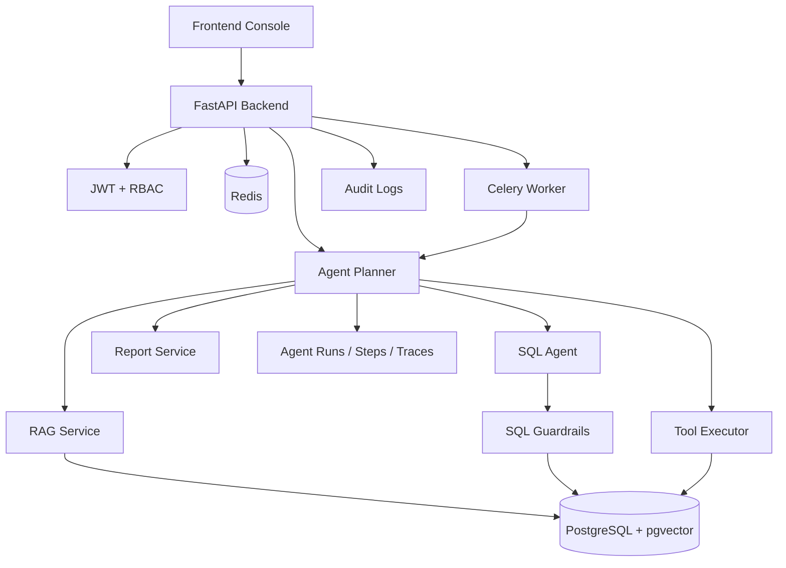

# Enterprise Multi-Tool Agent Platform

企业级多工具知识库 Agent 平台，支持 RAG 文档问答、SQL Agent 数据查询、Tool Calling、多步骤任务编排、异步报告生成、权限控制、SQL 安全防护、审批流、Trace 与 Audit。

Enterprise Multi-Tool Agent Platform is an enterprise-grade AI Agent platform that combines RAG, SQL Agent, Tool Calling, multi-step planning, async report generation, RBAC, SQL Guardrails, tracing, and audit logging.

当前完成阶段：**阶段九：工程保障、可观测性与评测体系**。

## What This Project Solves

普通 RAG Demo 通常只能回答文档问题。本项目模拟企业内部 AI 平台的完整工作流：Agent 可以读取知识库、查询结构化业务数据、调用受权限保护的工具、生成异步报告、进入人工审批，并留下完整 Trace 与 Audit Log。

核心 Demo 主线：

```text
登录平台 -> 上传制度/售后文档 -> Seed 订单异常数据 -> Agent Chat 提问
-> SQL Node 查询订单异常 -> RAG Node 检索知识库 -> Report Node 生成报告
-> Run Trace 回放 -> Reports 查看 -> Approval 审批邮件草稿 -> Audit 查看记录
```

推荐问题：

```text
结合最近 30 天订单异常数据和售后知识库生成一份分析报告。
```

## Phase Progress

| Phase | Scope | Status |
| --- | --- | --- |
| 1 | FastAPI, PostgreSQL + pgvector, Redis, Celery, JWT, RBAC, Alembic, Docker Compose | Done |
| 2 | RAG 文档解析、切分、Embedding、向量检索 | Done |
| 3 | SQL Agent 与 SQL Guardrails | Done |
| 4 | Tool Calling 与工具注册执行 | Done |
| 5 | Agent Planner 多步骤编排 | Done |
| 6 | 异步任务、任务进度、取消、幂等与报告历史 | Done |
| 7 | 前端后台、可视化控制台、权限菜单与演示页面 | Done |
| 8 | Demo 数据、公开资料接入与 GitHub 展示优化 | Done |
| 9 | 工程保障、可观测性与评测体系 | Done |

## Core Features

- RAG knowledge-base Q&A with document parsing, chunking, embeddings, pgvector search and citations.
- SQL Agent analytics with schema reading, SQL generation, safe execution and result explanation.
- SQL Guardrails that only allow safe read-only queries, block dangerous operations, reject `SELECT *`, enforce `LIMIT`, and protect sensitive tables/fields.
- Tool Calling platform with registry metadata, JSON Schema validation, permissions, retries, timeouts and traceable execution.
- Agent Planner that routes `GENERAL_CHAT`, `RAG_QA`, `SQL_QUERY`, `TOOL_CALL`, `MULTI_STEP_REPORT` and `NEED_APPROVAL`.
- Async Agent tasks and report generation with Celery, Redis, progress APIs, cancellation and report history.
- Human-in-the-loop approval for sensitive actions such as email draft generation.
- RBAC for Admin, Developer, User and Guest roles.
- Full traceability through agent runs, steps, traces, tool calls, SQL logs and audit logs.
- Mock LLM and Mock Embedding providers so the full demo can run without real API keys.
- Provider call metrics, token/mock-token cost estimates, eval datasets and regression runners for engineering assurance.
- Next.js frontend console for Dashboard, Knowledge Base, Agent Chat, SQL Agent, Tools, Approvals, Runs, Tasks, Reports, Audit and Admin Users.

## Tech Stack

- Frontend: Next.js, React, TypeScript, Tailwind CSS
- Backend: FastAPI, SQLAlchemy 2.x, Pydantic
- Agent foundation: lightweight runtime with LangGraph-compatible boundaries
- Database: PostgreSQL 16 + pgvector
- Cache and queue: Redis, Celery
- Auth: JWT + RBAC
- Migration: Alembic
- Providers: Mock, OpenAI-ready provider abstraction
- Deploy: Docker Compose

## Architecture



More detail: [docs/ARCHITECTURE_OVERVIEW.md](docs/ARCHITECTURE_OVERVIEW.md)

## Quick Start

```bash
cp .env.example .env
cp frontend/.env.example frontend/.env.local
docker compose up -d --build
bash scripts/seed_demo_data.sh
```

Open:

- Backend Swagger: http://localhost:8100/docs
- Health check: http://localhost:8100/health
- Frontend console: http://localhost:3100

Demo accounts:

| Role | Email | Password |
| --- | --- | --- |
| Admin | admin@example.com | admin123 |
| Developer | developer@example.com | dev123 |
| User | user@example.com | user123 |
| Guest | guest@example.com | guest123 |

## Local Development

Backend:

```bash
cd backend
python -m venv .venv
source .venv/bin/activate
pip install -r requirements.txt
alembic -c alembic.ini upgrade head
python -m app.seed.seed_all
cd ..
bash scripts/run_backend.sh
```

Frontend:

```bash
cd frontend
npm install
npm run dev
```

Tests:

```bash
cd backend
python -m pytest app/tests
cd ../frontend
npm run build
```

## Demo Data

Stage 8 adds public-safe demo assets:

- `data/demo_docs/`: self-written policy and after-sales Markdown files for RAG.
- `data/demo_orders/`: deterministic simulated CSV data for SQL Agent analytics.
- `docs/PUBLIC_DATA_SOURCES.md`: data source and compliance statement.
- `docs/DEMO_CASES.md`: eight demo cases covering general chat, RAG, SQL, tools, reports, async tasks, approval and Guardrails.
- `docs/DEMO_GUIDE.md`: step-by-step local demo guide.
- `docs/DEMO_SCRIPT.md`: recording and interview script.

The order data is simulated and covers 10 states, 10 product categories, 320 orders, 400 order items, 320 reviews and more than 80 after-sales cases.

## Demo Flow

1. Log in as `admin@example.com`.
2. Open Knowledge Base and upload files from `data/demo_docs/`.
3. Open Agent Chat and ask a policy question.
4. Ask `哪个地区的异常订单最多？` to trigger SQL Agent.
5. Ask the multi-step report question.
6. Open Runs to inspect SQL Node, RAG Node and Report Node.
7. Open Reports to view the generated Markdown report.
8. Ask for an email draft and approve it in Approvals.
9. Open Audit Log to verify traceability.

Full guide: [docs/DEMO_GUIDE.md](docs/DEMO_GUIDE.md)

## Core APIs

- `POST /api/auth/login`
- `GET /api/dashboard/summary`
- `POST /api/kb`
- `POST /api/kb/{id}/documents`
- `POST /api/kb/{id}/search`
- `POST /api/chat/rag`
- `GET /api/sql-agent/schema`
- `POST /api/sql-agent/query`
- `GET /api/tools`
- `POST /api/tools/{tool_name}/invoke`
- `POST /api/agent/chat`
- `GET /api/runs/{run_id}/traces`
- `GET /api/tasks/{task_id}/progress`
- `GET /api/reports/{report_id}`
- `GET /api/approvals`
- `POST /api/approvals/{approval_id}/approve`
- `GET /api/audit-logs`
- `GET /api/metrics/summary`
- `GET /api/metrics/agent-runs`
- `GET /api/metrics/providers`
- `GET /api/evals/runs`

## Observability and Eval

Stage 9 adds:

- `provider_calls` metrics for Mock/OpenAI provider latency, token estimates, status and estimated cost.
- Metrics API for Agent runs, RAG, SQL Guardrails, tools, async tasks and providers.
- RAG, SQL Guardrails, Tool, Agent and Regression JSONL datasets under `backend/app/evals/`.
- CLI runners: `python -m app.scripts.run_eval --type ...` and `python -m app.scripts.run_regression`.
- Dashboard metric cards for success rates, latency, SQL blocks, provider calls and estimated cost.

Docs:

- [docs/OBSERVABILITY_AND_EVAL.md](docs/OBSERVABILITY_AND_EVAL.md)
- [docs/EVAL_REPORT_TEMPLATE.md](docs/EVAL_REPORT_TEMPLATE.md)
- [docs/METRICS_DEFINITION.md](docs/METRICS_DEFINITION.md)
- [docs/REGRESSION_TEST_GUIDE.md](docs/REGRESSION_TEST_GUIDE.md)

Docker cold-start and container integration acceptance passed on 2026-07-03. The validation covered Docker cold start, DB/Celery/API connectivity, idempotent demo seed, frontend-to-real-API smoke tests, container backend tests, frontend lint/build and public safety checks.

## Frontend Pages

- Login
- Dashboard
- Knowledge Base
- Document Upload
- Agent Chat
- SQL Agent
- Tools
- Approvals
- Runs and Run Trace
- Tasks
- Reports
- Audit Log
- Admin Users

## Security Design

- No real API keys are committed.
- `.env.example` files are configuration templates.
- Missing real provider keys automatically fall back to Mock providers.
- Frontend never stores model provider keys in `NEXT_PUBLIC_*`.
- SQL Agent only executes Guardrails-protected read-only queries.
- `send_email_draft` creates a draft and approval record; it does not send real email.
- Sensitive operations require human approval.
- Tool calls, SQL queries, Agent runs and important user actions are traceable.

Before publishing:

```bash
bash scripts/check_public_safety.sh
```

## Screenshots

> Screenshots will be added after the final demo run.

Planned screenshots are listed in [docs/SCREENSHOTS.md](docs/SCREENSHOTS.md).

## Resume Summary

See [docs/RESUME_DESCRIPTION.md](docs/RESUME_DESCRIPTION.md) for Chinese and English resume descriptions, project highlights and interview talking points.

## Roadmap

- Stage 9: observability, token/cost metrics, task duration metrics, RAG evals, SQL safety evals and regression datasets. Done.
- Stage 10: deployment, CI/CD, production Docker Compose, GitHub Actions and security headers.
- Stage 11: resume packaging, architecture explanation, interview Q&A and final demo material.
- Stage 12: final release checklist, GitHub publication, release tag and project retrospective.
