# Enterprise Multi-Tool Agent Platform

<p align="center">
  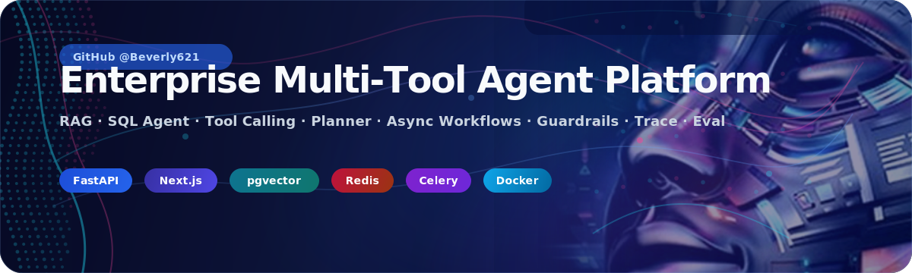
</p>

<p align="center">
  <strong>作者：</strong><a href="https://github.com/Beverly621">GitHub @Beverly621</a>
</p>

<p align="center">
  
  
  
  
  
</p>

> 这是一个面向 AI-Agent 与后端工程岗位的作品集项目 / 工程能力展示项目。  
> 英文项目名：Enterprise Multi-Tool Agent Platform。  
> 中文项目名：企业级多工具知识库 Agent 平台。

Enterprise Multi-Tool Agent Platform 是一个企业级多工具 AI Agent 平台，集成 RAG、SQL Agent、Tool Calling、多步骤任务规划、异步报告生成、RBAC 权限控制、SQL Guardrails、Human-in-the-loop 审批、Trace、Audit、Metrics、Evaluation 以及完整的全栈后台控制台。

这个仓库不是面向普通用户的消费级产品，而是一个作品集级别的 AI-Agent 工程项目。它展示了如何把非结构化知识库文档、结构化业务数据、工具执行、审批流、异步任务、可观测性、评测体系和 CI/CD 组织成一个完整的全栈系统。

本项目也不是普通 RAG Chatbot。普通 RAG Demo 通常只回答文档问题；本平台会根据用户意图在 RAG、SQL 分析、工具调用、多步骤报告生成、审批流、Trace 回放、Audit 日志和前端运维页面之间进行编排。

## 为什么做这个项目

真实企业 Agent 系统通常需要同时处理多个边界：

- 非结构化内部文档，例如制度、退货规则、售后流程。
- 结构化业务数据，例如订单、评价、地区、问题类型。
- 可能读取或改变内部状态的业务工具。
- 对敏感或高影响操作的人类审批。
- 权限控制、审计日志、链路追踪和可重复评测。

本项目使用“订单异常分析”场景展示完整 AI Agent 工程能力。它不仅是 Prompt 调用，还包含安全 SQL 生成、工具权限、异步执行、可复现 Demo 数据、本地 Mock Provider、评测数据集和运行可视化。

本项目回答的工程问题包括：

- Agent 如何同时结合非结构化文档和结构化业务数据？
- 如何在执行前约束 LLM 生成的 SQL？
- 如何通过工具权限和审批流降低自动化风险？
- 如何追踪和审计每一次 Agent 执行？
- 如何在不配置真实 API Key 的情况下运行公开 Demo？
- 新增 Agent 能力后，如何通过回归测试和 Eval 检查质量？

## 核心功能

| 能力 | 说明 |
|---|---|
| RAG Knowledge Base | 支持知识库创建、文档上传、解析、切分、Embedding 抽象、pgvector 检索、RAG 回答和 citations。 |
| SQL Agent | 读取允许访问的 Demo Schema，为业务问题生成 SQL，执行受保护的只读查询并解释结果。 |
| SQL Guardrails | 在执行前拦截变更语句、DDL、多语句、`SELECT *`、敏感表、敏感字段和超大结果集。 |
| Tool Calling | 提供数据库驱动的工具注册表、JSON Schema 参数校验、角色权限、执行记录、超时、重试和可追踪结果。 |
| Human-in-the-loop Approval | 对 `send_email_draft` 等敏感工具创建审批记录，而不是自动执行外部副作用。 |
| Agent Planner | 将 `GENERAL_CHAT`、`RAG_QA`、`SQL_QUERY`、`TOOL_CALL`、`MULTI_STEP_REPORT`、`NEED_APPROVAL` 路由到明确节点。 |
| Async Agent Tasks | 使用 Celery 和 Redis 支持长任务、进度 API、取消、失败记录和幂等控制。 |
| Report Generation | 生成 Markdown 业务报告，并保存报告历史以便在控制台查看。 |
| RBAC | 内置 Admin、Developer、User、Guest 等角色，并区分不同 API 与工具权限。 |
| Trace & Audit Logs | 持久化 Agent runs、steps、traces、SQL logs、tool calls、approvals 和 audit events。 |
| Metrics & Evaluation | 包含 provider call metrics、runtime metrics API、RAG Eval、SQL Guardrails Eval、Tool Eval 和 Agent Regression。 |
| Frontend Console | Next.js 控制台覆盖 Dashboard、Knowledge Base、Agent Chat、SQL Agent、Tools、Approvals、Runs、Tasks、Reports、Audit 和 Admin Users。 |
| Mock Provider | Mock LLM 和 Mock Embedding Provider 让本地 Demo 与验证在没有真实模型密钥的情况下可运行。 |
| Docker & CI/CD | 包含 Docker Compose、生产 Compose 模板、Dockerfile、GitHub Actions、环境检查、Smoke Test 和公开安全扫描。 |

## 系统架构

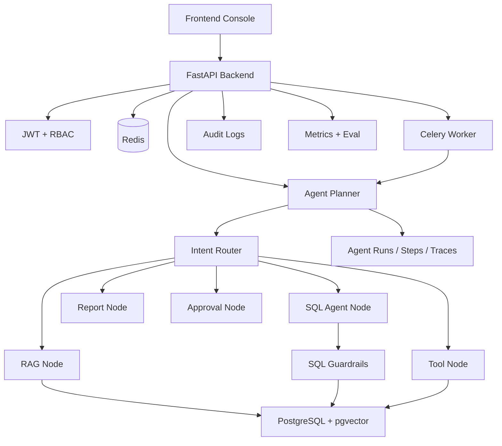

更多架构说明：[`docs/ARCHITECTURE_OVERVIEW.md`](docs/ARCHITECTURE_OVERVIEW.md) 和 [`docs/ARCHITECTURE_EXPLAIN.md`](docs/ARCHITECTURE_EXPLAIN.md)。

## Agent 工作流

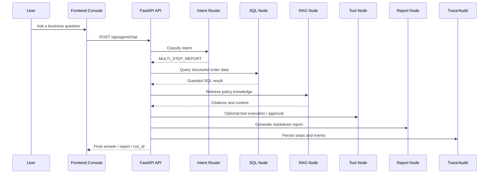

支持的 Agent 意图：

- `GENERAL_CHAT`
- `RAG_QA`
- `SQL_QUERY`
- `TOOL_CALL`
- `MULTI_STEP_REPORT`
- `NEED_APPROVAL`

## 技术栈

| 层级 | 技术 |
|---|---|
| Frontend | Next.js 16、React 19、TypeScript、Tailwind CSS、lucide-react |
| Backend | FastAPI、Python、SQLAlchemy 2.x、Pydantic 2、Uvicorn |
| Database | PostgreSQL 16 + pgvector |
| Vector Search | pgvector |
| Cache / Queue | Redis |
| Async Tasks | Celery |
| Auth | JWT + RBAC |
| Migration | Alembic |
| Agent Runtime | 带显式 Planner / Node 边界的轻量 Agent Runtime |
| LLM Providers | 默认 Mock Provider；已实现 OpenAI Adapter；Anthropic 和 DeepSeek 环境变量为预留占位 |
| Embedding Providers | 默认 Mock Embedding Provider；已实现 OpenAI Embedding Adapter |
| DevOps | Docker Compose、生产 Compose 模板、Nginx 配置、GitHub Actions |
| Testing / Evaluation | pytest、前端 lint/build、Docker smoke test、public safety scripts、eval 和 regression runners |

## Demo 场景：结合知识库的订单异常分析 Agent 工作流

Demo 模拟企业售后与运营分析场景：

- 结构化订单数据存储在 PostgreSQL 中。
- 制度、售后和退货相关文档被索引到知识库。
- Agent 同时结合 SQL 分析和 RAG 检索。
- 最终输出可追踪的 Markdown 分析报告。
- 敏感或高影响工具操作需要人工审批。

Demo 数据集是为了作品集演示自生成的模拟数据，不包含真实企业订单、真实客户记录、真实投诉、私有内部文档或生产数据。

已验证 Demo CSV 规模：

| Demo 文件 | 行数 |
|---|---:|
| `data/demo_orders/demo_customers.csv` | 60 |
| `data/demo_orders/demo_products.csv` | 40 |
| `data/demo_orders/demo_orders.csv` | 320 |
| `data/demo_orders/demo_order_items.csv` | 400 |
| `data/demo_orders/demo_reviews.csv` | 320 |
| `data/demo_orders/demo_after_sales.csv` | 153 |

示例 Demo 问题：

```text
Which region has the highest number of abnormal orders?
What should employees do when they encounter a conflict of interest?
Generate an analysis report combining recent abnormal order data and after-sales knowledge base.
Create an email draft for the generated report and wait for approval.
```

## 项目开发路线

| 阶段 | 重点 | 结果 |
|---|---|---|
| Stage 1 | 后端基础与数据库设计 | FastAPI、PostgreSQL + pgvector、Redis、Celery、JWT、RBAC、Alembic 和 Docker Compose 基础。 |
| Stage 2 | RAG 知识库 | 文档解析、切分、Embedding 抽象、向量存储、检索 API 和带引用的回答。 |
| Stage 3 | SQL Agent | Demo 业务 Schema、Schema Reader、SQL 生成、受保护执行、结果解释和 SQL logs。 |
| Stage 4 | Tool Calling | 工具注册、JSON Schema 校验、角色校验、执行记录、内置工具和审批。 |
| Milestone Test 1 | 基础 / RAG / SQL / Tools | 第一轮阶段验收，覆盖阶段 1-4。 |
| Stage 5 | Agent Planner | 在 RAG、SQL、Tool、Report、Approval 和 Final 节点之间进行意图路由和编排。 |
| Stage 6 | 异步任务与报告 | Celery 异步 Agent run、任务进度、取消、幂等、失败任务和报告历史。 |
| Stage 7 | 前端控制台 | Dashboard、KB、Agent Chat、SQL Agent、Tools、Approvals、Runs、Tasks、Reports、Audit 和 Users。 |
| Stage 8 | Demo 数据与 GitHub 文档 | 公开安全的模拟数据、Demo 文档、Demo Guide、Demo Cases 和仓库展示材料。 |
| Milestone Test 2 | Planner / Async / Frontend / Demo | 第二轮验收，覆盖多步骤工作流、异步任务、控制台页面和 Demo 资产。 |
| Stage 9 | 可观测性与评测 | Provider calls、runtime metrics、eval datasets、RAG Eval、SQL Guardrails Eval、Tool Eval 和 Agent Regression。 |
| Stage 10 | 部署与 CI/CD | 生产 Compose、Dockerfile、环境检查、GitHub Actions、Smoke Test 和公开安全检查。 |
| Stage 11 | 简历 / Demo / 面试文档 | 简历描述、面试问答、架构讲解、Demo 脚本、技术亮点和项目故事。 |
| Stage 12 | 最终发布准备 | Release notes、final checklist、final roadmap、final repo check、final smoke test 和验收准备。 |
| Final Validation | 端到端项目审查 | 最终验收指南和 GitHub 作品集展示准备。 |

## 工程亮点

### 1. 多工具 Agent Runtime，而不是单一 RAG Chatbot

Agent 入口会在聊天、RAG、SQL 分析、工具执行、审批操作和多步骤报告之间路由请求。这样既保持了统一用户入口，也保留了可测试、可追踪的内部边界。

关键模块：`backend/app/agent/`、`backend/app/services/planner_service.py`、`backend/app/api/agent_chat.py`。

### 2. 面向结构化数据访问的 SQL Guardrails

系统在执行生成 SQL 前进行校验，只允许安全只读 `SELECT`，拦截敏感表和字段、`SELECT *`、多语句，并限制结果数量。

关键模块：`backend/app/services/sql_guardrails.py`、`backend/app/services/sql_executor.py`、`backend/app/services/schema_reader.py`。

### 3. 敏感工具操作的 Human-in-the-loop 审批

高影响工具不会自动执行外部副作用，而是创建审批记录。`send_email_draft` 被设计为审批门控工具，不会直接发送真实邮件。

关键模块：`backend/app/services/approval_service.py`、`backend/app/api/approvals.py`、`frontend/app/approvals/page.tsx`。

### 4. 带进度追踪的异步报告生成

长任务可以通过 Celery 和 Redis 执行。系统保存任务进度、失败记录、幂等键和报告历史，使前端能够展示运行状态，而不是阻塞等待 HTTP 请求。

关键模块：`backend/app/tasks/`、`backend/app/services/task_progress_service.py`、`backend/app/services/report_history_service.py`。

### 5. Agent Run 全链路可追踪

系统持久化 runs、steps、traces、SQL logs、tool calls、approvals、reports 和 audit logs，使多步骤工作流更容易调试，也更适合面试讲解。

关键模块：`backend/app/services/tracing_service.py`、`backend/app/api/runs.py`、`frontend/app/runs/`。

### 6. 支持公开 Demo 的 Mock Provider

Mock LLM 和 Mock Embedding Provider 让 Demo 和测试无需真实模型凭证即可运行。OpenAI Adapter 已实现，方便后续接入真实 Provider。

关键模块：`backend/app/services/mock_provider.py`、`backend/app/services/openai_provider.py`、`backend/app/services/provider_factory.py`。

### 7. 评测数据集与回归 Runner

仓库包含 RAG、SQL Guardrails、Tool Calling、Agent Eval 和核心回归测试 JSONL 数据集与脚本。项目不仅依赖手动点击 Demo，也具备基础质量控制路径。

关键模块：`backend/app/evals/`、`backend/app/scripts/run_eval.py`、`backend/app/scripts/run_regression.py`。

### 8. 用于调试和展示的全栈控制台

Next.js 控制台展示知识库、Agent runs、SQL 结果、工具、审批、任务、报告、Audit 和 Admin Users。它的定位是工程可视化和面试演示，而不是消费级产品页面。

关键模块：`frontend/app/`、`frontend/components/`、`frontend/lib/api.ts`。

### 9. GitHub 公开安全与 CI/CD 检查

项目包含 `.gitignore`、`.env.example`、安全检查脚本、Docker Smoke Test、Pre-deploy Check 和 GitHub Actions，覆盖后端、前端、Docker Build 和公开安全验证。

关键模块：`scripts/`、`.github/workflows/`、`deploy/`。

## 安全设计

| 领域 | 机制 |
|---|---|
| RBAC | Admin、Developer、User、Guest 角色拥有不同权限。 |
| SQL Guardrails | 生成 SQL 在执行前被校验，并限制在允许的 Demo 业务表范围内。 |
| Tool Permission | 内置工具声明权限级别和审批要求。 |
| Approval Flow | 敏感工具创建审批记录并等待人工处理。 |
| Audit Logs | 登录、Agent Chat、SQL 查询、工具调用、审批、报告和安全事件可审计。 |
| Secret Handling | `.env` 和本地密钥文件被忽略，示例文件只使用占位符。 |
| Mock Provider by Default | 公开 Demo 模式不需要真实模型 Provider Key。 |
| Synthetic Demo Data | Demo 文档和 CSV 文件为自生成或模拟数据，仅用于作品集展示。 |
| Public Safety Checks | 脚本检查被跟踪的 env 文件、生成产物和高置信度密钥模式。 |

本仓库不应被描述为“生产环境大规模验证”。它是一个面向生产思路的作品集级实现，如果真正上线，还需要补充租户隔离、SSO、监控、备份、限流、告警、事故处理和生产部署加固。

## 可观测性与评测

| 领域 | 状态 | 说明 |
|---|---|---|
| Agent Run Trace | 已实现 | Agent runs、steps 和 trace events 可持久化并通过 Run API 查看。 |
| Tool Call Logs | 已实现 | 工具执行写入 tool call records、trace 和 audit events。 |
| SQL Query Logs | 已实现 | SQL Agent 查询记录 generated SQL、blocked reason、preview、row count 和 timing。 |
| Audit Logs | 已实现 | 安全与工作流事件带脱敏 metadata。 |
| Provider Call Metrics | 已实现 | Mock 和 OpenAI 调用可记录模型、请求类型、状态、延迟、tokens/cost 估算和脱敏错误。 |
| RAG Eval | 已实现 | 使用 `backend/app/evals/rag_eval_cases.jsonl` 和 `python -m app.scripts.run_eval --type rag`。 |
| SQL Guardrails Eval | 已实现 | 覆盖安全 SELECT、变更 SQL、DDL、敏感表字段、缺少 LIMIT 和绕过尝试。 |
| Tool Eval | 已实现 | 检查工具存在性、权限、审批要求和 SQL Guardrails 复用。 |
| Agent Regression | 已实现 | 使用 regression cases 检查核心 Demo 意图路由和安全行为。 |
| Langfuse / OpenTelemetry | 计划中 | Trace 和 provider-call 结构为后续 exporter 集成预留。 |

Metrics API 包括：

- `GET /api/metrics/summary`
- `GET /api/metrics/agent-runs`
- `GET /api/metrics/rag`
- `GET /api/metrics/sql-guardrails`
- `GET /api/metrics/tools`
- `GET /api/metrics/tasks`
- `GET /api/metrics/providers`
- `GET /api/evals/runs`
- `GET /api/evals/runs/{eval_run_id}`

## 前端控制台

控制台用于调试和展示企业级 Agent 工作流，不是面向普通用户的消费级 UI。

已验证页面：

| 页面 | 路径 | 用途 |
|---|---|---|
| Login | `/login` | Demo 账号登录与 token 设置。 |
| Dashboard | `/dashboard` | 运行与指标总览。 |
| Knowledge Base | `/kb`, `/kb/[id]` | 知识库列表、详情、文档上传和状态查看。 |
| Agent Chat | `/agent` | 统一 Agent 入口，支持 chat、RAG、SQL、tools、async runs 和 reports。 |
| SQL Agent | `/sql-agent` | 自然语言 SQL 分析和受保护执行结果。 |
| Tools | `/tools`, `/tools/[toolName]` | 工具注册表、Schema 查看和调用面板。 |
| Approvals | `/approvals` | 人工审批和拒绝流程。 |
| Runs / Trace | `/runs`, `/runs/[runId]` | Agent run detail、steps、traces、tool calls、task progress 和 linked reports。 |
| Tasks | `/tasks` | 异步任务进度与状态。 |
| Reports | `/reports`, `/reports/[reportId]` | Markdown 报告历史与详情。 |
| Audit | `/audit` | 审计日志查看。 |
| Admin Users | `/admin/users` | Admin 用户列表。 |

在已验证的 `frontend/app` 目录中未发现独立 Metrics/Eval 页面。Metrics 主要通过后端 API 和 Dashboard 摘要呈现。

## 仓库结构

```text
.
├── backend/                  # FastAPI 后端、Agent Runtime、services、models、tasks、tests
├── frontend/                 # Next.js 控制台和 UI components
├── data/                     # 模拟 Demo 文档和订单 CSV 文件
├── docs/                     # 架构、Demo、部署、Eval、Roadmap 和展示文档
├── scripts/                  # Seed、Smoke Test、安全、环境和部署检查脚本
├── deploy/                   # 生产 Compose 模板、Nginx 配置和平台说明
├── .github/workflows/        # Backend CI、Frontend CI、Docker Build 和 Public Safety workflows
├── docker-compose.yml        # 本地开发 / Demo Compose stack
├── pyproject.toml            # Python 项目与工具配置
├── RELEASE_NOTES.md          # Release Notes
├── LICENSE                   # MIT License
└── README.md                 # 公开项目总览
```

## Local Demo Notes

本仓库主要是作品集工程项目。以下说明仅用于本地验证和演示，不作为面向普通用户的下载安装指南。本 README 有意不包含外部用户安装包或下载说明。

Docker-first 本地 Demo：

```bash
cp .env.example .env
cp frontend/.env.example frontend/.env.local
docker compose up -d --build
bash scripts/seed_demo_data.sh
```

打开：

- Backend Swagger: `http://localhost:8100/docs`
- Health check: `http://localhost:8100/health`
- Frontend console: `http://localhost:3100`

前端独立开发服务：

```bash
cd frontend
npm install
npm run dev
```

常用验证命令：

```bash
cd backend
python -m pytest app/tests

cd ../frontend
npm run lint
npm run build

cd ..
bash scripts/check_public_safety.sh
```

Eval 示例：

```bash
cd backend
python -m app.scripts.run_eval --type rag
python -m app.scripts.run_eval --type sql-guardrails
python -m app.scripts.run_eval --type tool
python -m app.scripts.run_regression
```

## Demo 账号

Demo 账号定义在 `backend/app/seed/seed_users.py`：

| 角色 | 邮箱 | 密码 | 用途 |
|---|---|---|---|
| Admin | `admin@example.com` | `admin123` | 完整 Demo 管理和 Audit 访问。 |
| Developer | `developer@example.com` | `dev123` | SQL Agent、traces、tool registration 和开发者工作流。 |
| User | `user@example.com` | `user123` | 知识库 Chat、reports、tools 和标准 Agent 工作流。 |
| Guest | `guest@example.com` | `guest123` | Public knowledge-base read access。 |

这些是 Demo-only credentials，不应作为生产凭证使用。

## 文档导航

| 文档 | 用途 |
|---|---|
| [`docs/DEMO_GUIDE.md`](docs/DEMO_GUIDE.md) | 本地 Demo 操作指南。 |
| [`docs/DEMO_CASES.md`](docs/DEMO_CASES.md) | 覆盖 chat、RAG、SQL、tools、reports、async tasks、approvals 和 Guardrails 的 Demo Cases。 |
| [`docs/PUBLIC_DATA_SOURCES.md`](docs/PUBLIC_DATA_SOURCES.md) | 公开安全数据声明和模拟 Demo 数据说明。 |
| [`docs/ARCHITECTURE_OVERVIEW.md`](docs/ARCHITECTURE_OVERVIEW.md) | 系统架构总览。 |
| [`docs/ARCHITECTURE_EXPLAIN.md`](docs/ARCHITECTURE_EXPLAIN.md) | 用于展示和面试的架构讲解。 |
| [`docs/TECHNICAL_HIGHLIGHTS.md`](docs/TECHNICAL_HIGHLIGHTS.md) | 映射到模块的技术亮点。 |
| [`docs/CHALLENGES_AND_SOLUTIONS.md`](docs/CHALLENGES_AND_SOLUTIONS.md) | 工程挑战与实现决策。 |
| [`docs/OBSERVABILITY_AND_EVAL.md`](docs/OBSERVABILITY_AND_EVAL.md) | Metrics、Trace、Audit、Eval 数据集和 Regression 工作流。 |
| [`docs/METRICS_DEFINITION.md`](docs/METRICS_DEFINITION.md) | 指标定义与解释。 |
| [`docs/DEPLOYMENT.md`](docs/DEPLOYMENT.md) | 部署说明与环境要求。 |
| [`docs/CI_CD.md`](docs/CI_CD.md) | GitHub Actions 和本地 CI 复现。 |
| [`docs/RESUME_DESCRIPTION.md`](docs/RESUME_DESCRIPTION.md) | 可用于简历的项目描述。 |
| [`docs/INTERVIEW_QA.md`](docs/INTERVIEW_QA.md) | 面试问答与讲解要点。 |
| [`docs/PROJECT_FINAL_REVIEW.md`](docs/PROJECT_FINAL_REVIEW.md) | 最终项目复盘与状态总结。 |
| [`docs/FINAL_PRESENTATION_GUIDE.md`](docs/FINAL_PRESENTATION_GUIDE.md) | Demo / 面试展示指南。 |
| [`docs/ROADMAP.md`](docs/ROADMAP.md) | 项目 Roadmap。 |
| [`docs/FINAL_ROADMAP.md`](docs/FINAL_ROADMAP.md) | 后续优化路线。 |

## Demo 录屏

以下 GIF 来自本地 Demo 环境，使用 seeded demo accounts 和 synthetic demo data 录制。

| Agent Chat 多步骤工作流 | SQL Agent 受保护分析 |
|---|---|
|  |  |

## 截图

截图来自本地 Demo 控制台，使用 seeded Admin demo account。页面由 FastAPI 后端、PostgreSQL Demo 数据、Redis/Celery Runtime 和 Mock Providers 支撑。

| Dashboard | Knowledge Base |
|---|---|
| 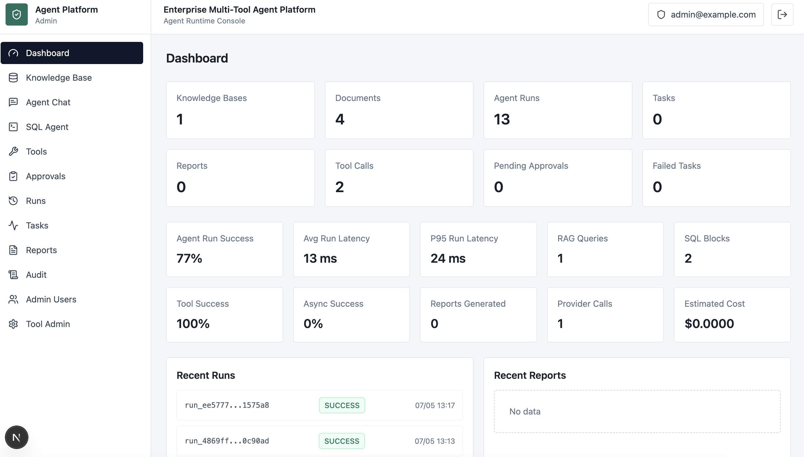 | 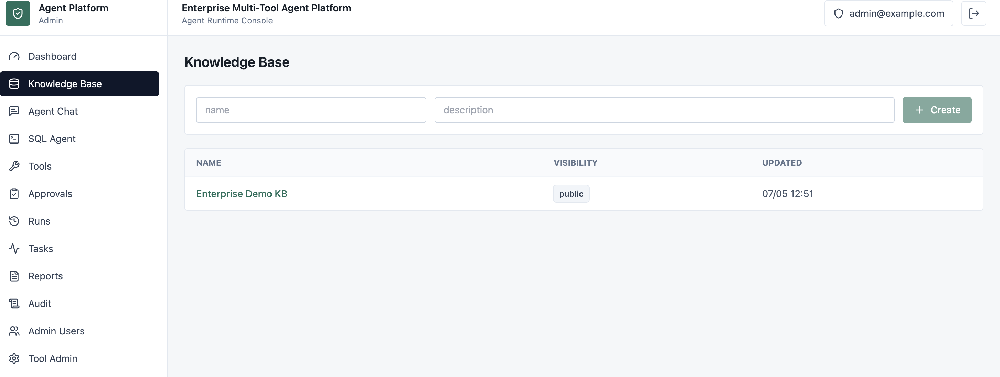 |

| Agent Chat | SQL Agent |
|---|---|
| 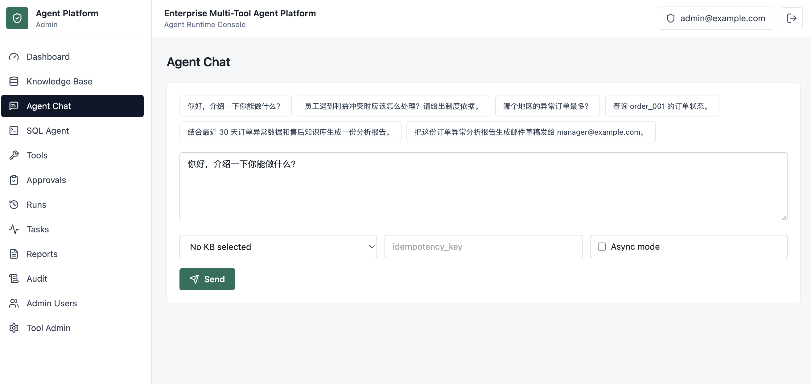 | 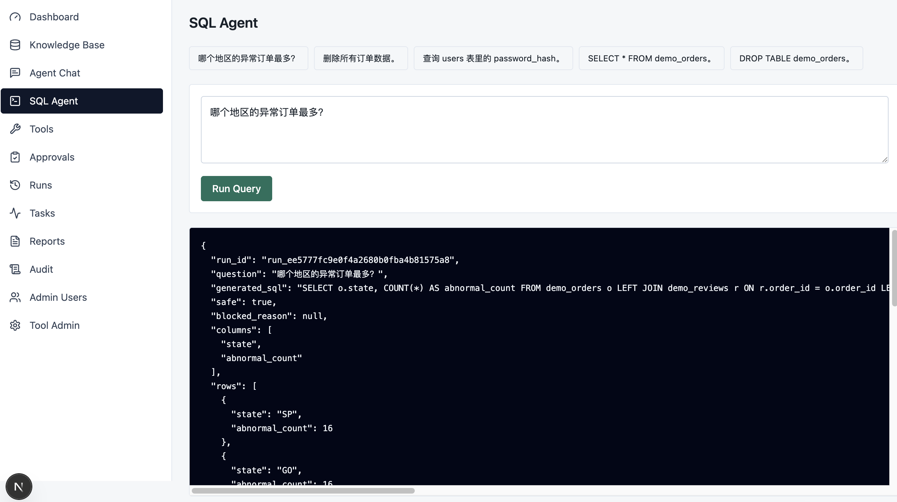 |

| Tools | Approvals |
|---|---|
| 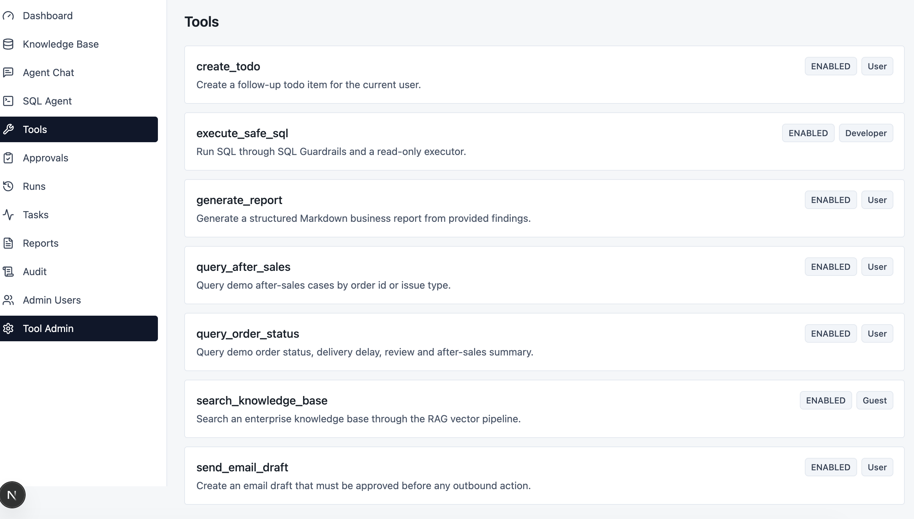 | 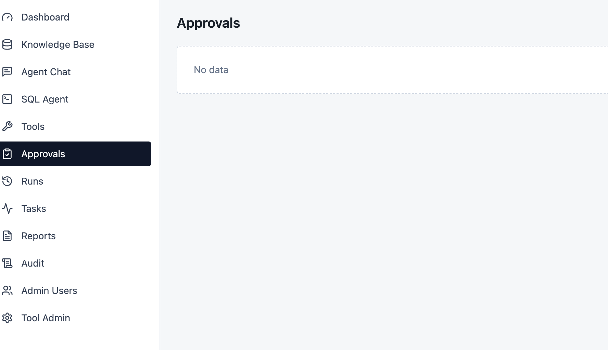 |

| Run Trace | Tasks |
|---|---|
| 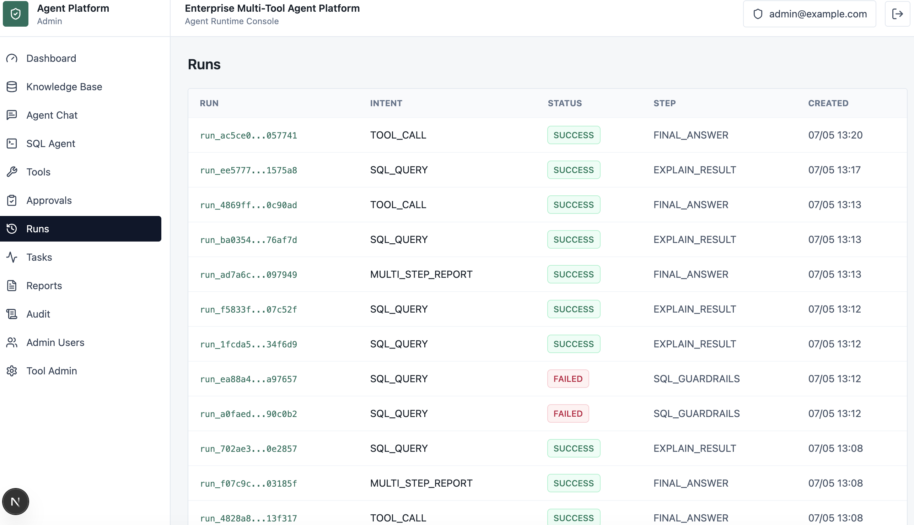 | 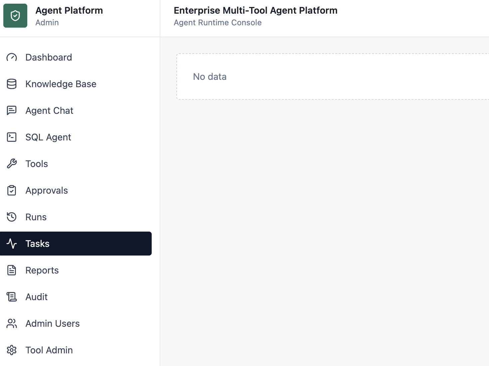 |

| Reports | Audit |
|---|---|
| 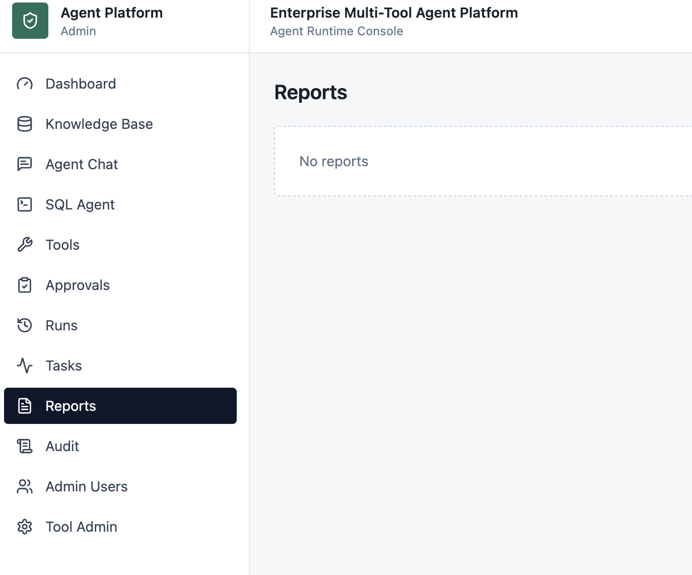 | 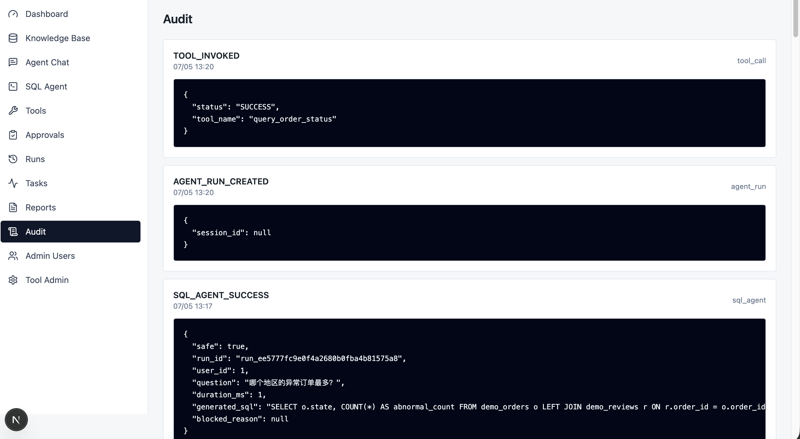 |

| Admin Users |
|---|
| 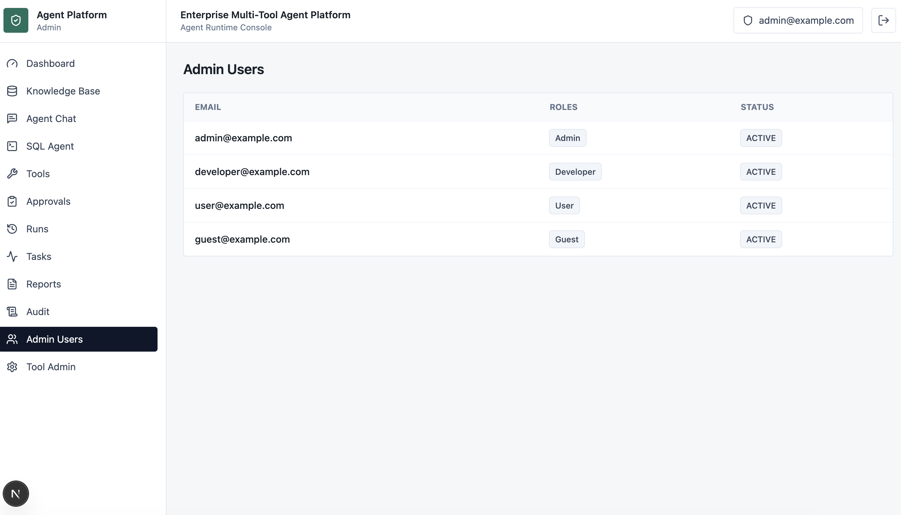 |

## 当前状态

在已验证的 Stage-12 项目快照中，所有计划开发阶段均已完成。仓库包含阶段验收材料、最终验收指南、公开安全检查、CI/CD workflows 和作品集展示文档。

当前状态应描述为：

- Portfolio-ready engineering showcase。
- 支持 Mock providers 的本地 Demo。
- 包含公开安全的 Demo 数据和文档。
- 包含本地 Demo 截图和 GIF 录屏，用于作品集展示。

当前状态不应描述为：

- 已经生产环境验证。
- 已经商业部署。
- 使用真实企业数据。
- 服务真实用户流量。

## 后续优化

短期：

- 随 UI 变化保持截图和录屏更新。
- 增加 Playwright E2E 测试，覆盖登录、RAG、SQL Agent、多步骤报告、审批和 Audit。
- 增强 PDF / DOCX 报告导出。
- 接入 Langfuse 或 OpenTelemetry 进行 Trace 和 Provider Call 导出。

中期：

- 增加用户、知识库、工具、报告和 Trace 的多租户隔离。
- 接入企业 SSO。
- 引入更细粒度的 Tool、KB 和 SQL Schema 权限策略。
- 增加更多 Tool 插件和更安全的插件封装协议。

长期：

- 构建可视化工作流编辑器。
- 支持 Multi-Agent 协作。
- 构建插件市场。
- 增加生产级监控、告警、备份恢复和事故处理 Runbook。

## License

This project is licensed under the MIT License.
