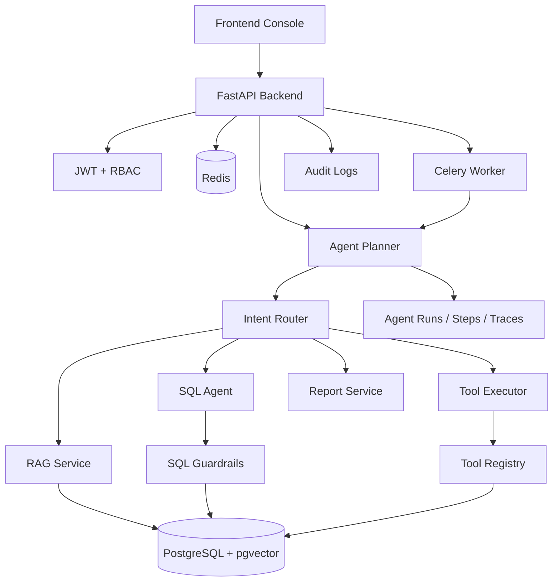

# Architecture Overview

Enterprise Multi-Tool Agent Platform combines a Next.js console, FastAPI backend, Agent Planner, RAG pipeline, SQL Agent, Tool Calling, Celery async tasks, RBAC, tracing and audit logging.

## Frontend Console

The frontend provides login, dashboard, knowledge-base management, document upload, Agent Chat, SQL Agent demo, tools, approvals, runs, tasks, reports, audit logs and admin users.

## Backend API Layer

FastAPI exposes authentication, RBAC-protected resources, RAG endpoints, SQL Agent endpoints, tool execution, Agent chat, async task progress, report history and audit APIs.

## Agent Runtime

The Agent Planner routes requests into intent-specific nodes:

- `GENERAL_CHAT`
- `RAG_QA`
- `SQL_QUERY`
- `TOOL_CALL`
- `MULTI_STEP_REPORT`
- `NEED_APPROVAL`

Multi-step reports combine SQL analysis, knowledge retrieval and report generation with traceable run steps.

## RAG Pipeline

Documents are parsed, chunked, embedded, stored in PostgreSQL + pgvector and retrieved with citations.

## SQL Agent Pipeline

SQL Agent reads only allowlisted demo schema metadata, generates or accepts safe queries, applies Guardrails, executes read-only SQL and explains results.

## Tool Calling Layer

Tools are registered with schemas, permissions, timeout policies and audit requirements. Built-in tools include knowledge search, safe SQL, order status lookup, after-sales lookup, report generation, email draft creation and todo creation.

## Async Task Layer

Celery and Redis power long-running Agent and report workflows. API requests return `run_id` and `task_id` immediately when `async_mode=true`.

## Data Layer

PostgreSQL stores users, roles, permissions, knowledge bases, documents, chunks, demo orders, reports, traces, audit logs, tool calls and approvals. pgvector supports semantic retrieval.

## Security Layer

JWT, RBAC, SQL Guardrails, environment-variable provider configuration, Mock provider fallback and human approval protect sensitive flows.

## Trace / Audit Layer

Every important Agent workflow can write `agent_runs`, `agent_steps`, `agent_traces`, `tool_calls`, `sql_query_logs` and `audit_logs`.

